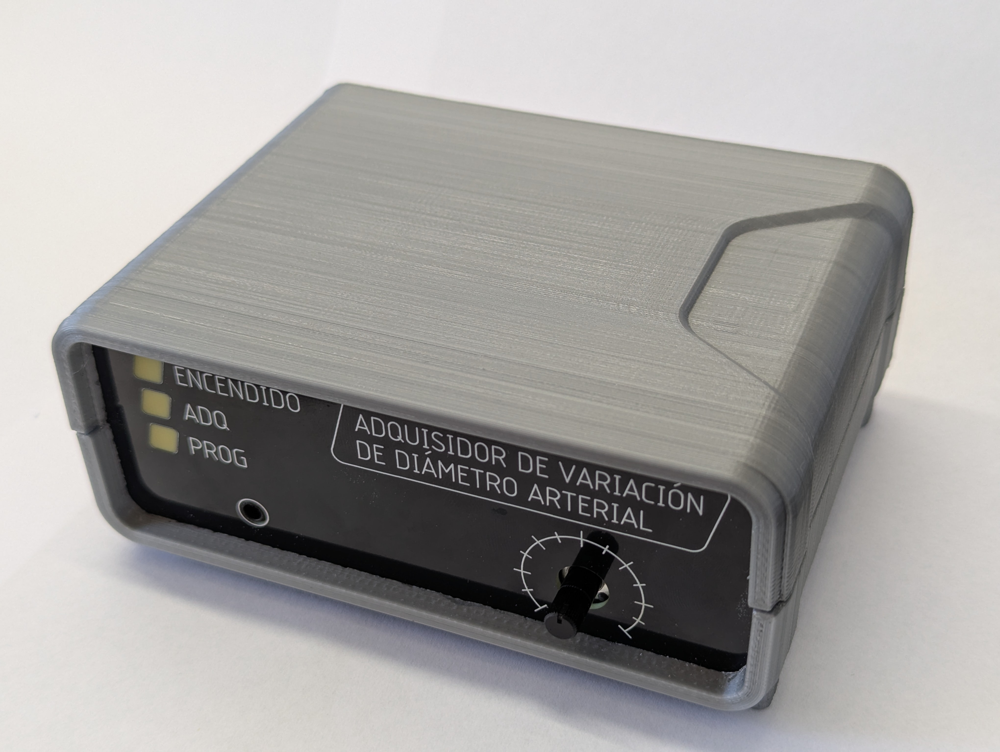

# VDA_Hardware

This repository contains the hardware design files for the **VDA Signal Acquisition System**, a device developed for the non-invasive measurement of **Arterial Diameter Variation (VDA)** using piezoelectric transducers. The system is intended for biomedical research applications and has been validated in laboratory environment.

## 📁 Repository Structure

- **/Adquisidor**  
  Contains all design files for the main acquisition board, including schematics, PCB layout, and bill of materials. This board handles signal conditioning, high-resolution analog-to-digital conversion, power regulation, and communication with the PC interface.

- **/frente del gabinete**  
  Includes the PCB designs used as front and rear panels for the device enclosure. These boards support mechanical mounting of connectors, status indicators, and user controls.

## 🛠️ Tools and Compatibility

- Designed using **Autodesk Eagle**  
- Compatible with Eagle version 9.6.2 or later

## ✅ Hardware Status

The version published here is fully functional and has been used in real experimental protocols and patient measurements. It is part of a broader open-source platform that includes firmware and a Python-based user interface.

Key features include:

- Support for a 27 mm piezoelectric transducer
- Fully differential charge amplifier
- Analog bandwidth: 0.16 Hz – 34 Hz
- 16-bit sigma-delta ADC
- 50 Hz digital notch filter
- Electrically isolated sensor interface

## 📂 Included Files

- `.sch` and `.brd` files (schematics and board layout)
- Bill of Materials (`.xls` / `.csv`)
- Gerber Files (`.grb`)
- Pick and Place file (`.csv`)
- Reference images of the PCB and assembly
  
## 📷 Preview

## 🧩 Related Work

This hardware was developed as part of a final project at the **Laboratorio de Bioingeniería (LABI)**, Universidad Nacional de Mar del Plata (Argentina), and was used in the context of scientific publications, including a peer-reviewed IEEE article.

## 📬 Contact

For questions, suggestions or collaboration, feel free to open an issue or contact me.

[leandrozabala@mdp.edu.ar](leandrozabala@mdp.edu.ar)

---